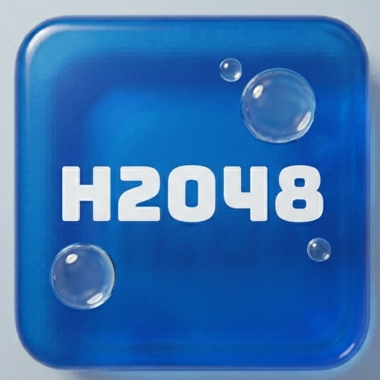

# 🧪 H2O48 : The Fusion Lab

Bienvenue dans **H2O48**, une réinterprétation moderne et fluide du célèbre jeu de réflexion 2048. Plongez dans un laboratoire numérique où la logique rencontre une esthétique dynamique et aquatique. Fusionnez les tuiles, gérez votre score et tentez d'atteindre la tuile ultime de **65 536** !

---

## ✨ Caractéristiques principales

* **🧪 Grille Étendue** : Par défaut en **6x6**, offrant un espace de jeu plus vaste pour des stratégies complexes et des scores monumentaux.
* **⏱️ Système de Chronomètre** : Un mode optionnel pour suivre votre temps et tenter de battre vos records de vitesse (Speedrunning).
* **🏆 Objectifs de Tuile** : Choisissez votre cible (de 2048 à 65 536) ou jouez en mode infini pour repousser vos limites.
* **💎 Interface Ultra-Fluide** : Animations de fusion soignées, effets de transparence (**Glassmorphism**) et perspective 3D pour une immersion totale.
* **💾 Sauvegarde Persistante** : Votre progression, votre meilleur score et vos records de temps sont sauvegardés localement via le `LocalStorage`.
* **📱 Accessibilité Hybride** : Jouez confortablement au clavier (flèches) ou via l'interface tactile optimisée pour mobile.

---

## 🎮 Comment Jouer ?

Le but est de faire glisser des tuiles numérotées sur une grille pour les combiner et créer une tuile avec le nombre **65 536** (ou votre objectif personnalisé).

1.  **Déplacement** : Utilisez les **touches directionnelles** ou les **boutons fléchés** à l'écran.
2.  **Fusion** : Lorsque deux tuiles identiques se touchent, elles fusionnent en une seule dont la valeur est le double.
3.  **Apparition** : Après chaque mouvement, une nouvelle tuile (2 ou 4) apparaît aléatoirement.
4.  **Score** : Chaque fusion augmente votre score actuel.

### ⚙️ Paramètres du Laboratoire
Accédez aux options via l'icône **paramètres** pour personnaliser votre expérience :
* **Temps** : Activer ou masquer le chronomètre.
* **Son** : Activer ou désactiver les effets sonores
* **Grille** : Modifier la taille de la grille (2x2, 4x4, 5x5, 6x6, etc.).
* **Objectifs** : Définir la tuile cible pour valider un record.
* **Réinitialisation** : Remettre à zéro vos records personnels enregistrés dans le navigateur.
* ***Mode de Jeu*** : Jouez avec des règles différentes dans des modes de jeux épiques : **Normal**, **Chrono**, **Négatifs**, **Gravité**, **Invisible**, **Zen** et ***Hard*** !
---

## 🛠️ Détails Techniques

Le projet repose sur une architecture **Vanilla JavaScript** pure, garantissant une exécution ultra-rapide sans dépendances lourdes.

### Stack Technologique
| Composant | Technologie |
| :--- | :--- |
| **Structure** | HTML5 (Sémantique) |
| **Style** | CSS3 (Flexbox, Grid, Animations Keyframes) |
| **Logique** | JavaScript ES6+ |
| **Typographie** | Google Fonts (Bungee) |
| **Icônes** | Font Awesome & SVG |

### Architecture du code
* **Moteur de rendu** : Synchronisation entre une matrice logique JS et le DOM pour des performances optimales.
* **Animations** : Gestion des classes CSS dynamiques (`tile-new`, `tile-merged`) pour un retour visuel hardware-accelerated.
* **Stockage** : API `localStorage` pour la persistance des données utilisateur.

---

## 🚀 Installation Locale

Pour lancer le "laboratoire" sur votre machine :

1.  **Récupérer le projet** :
    * Téléchargez le ZIP via GitHub (bouton "Code").
    * Ou clonez le dépôt : `git clone https://github.com/Pyronixus/H2O48.git`
2.  **Lancer le jeu** :
    * Ouvrez le fichier `index.html` dans n'importe quel navigateur moderne.
    * *Conseil : Utilisez l'extension "Live Server" sur VS Code pour un développement plus fluide.*

---

## 🎨 Design & Palette
L'esthétique de **H2O48** utilise des dégradés de bleu et de violet évoquant l'élément aquatique. 
* **Dynamisme** : Les couleurs des tuiles évoluent du bleu cyan léger au noir profond avec des accents néons à mesure que la valeur augmente.
* **Responsive** : La grille est entièrement adaptative pour garantir une expérience fluide sur tous les types d'écrans.

---

### 👨‍💻 À propos du développeur
#  [**Pyronixus**](https://github.com/Pyronixus) 
*Futur développeur Full-Stack passionné par le code et le design UI/UX*
